# Paper-Ladder Architecture

## System Overview

Paper-Ladder is a Python library for academic paper search and content extraction. It provides a unified interface to multiple academic APIs with automatic rate limiting, deduplication, and result aggregation.

## System Architecture Diagram

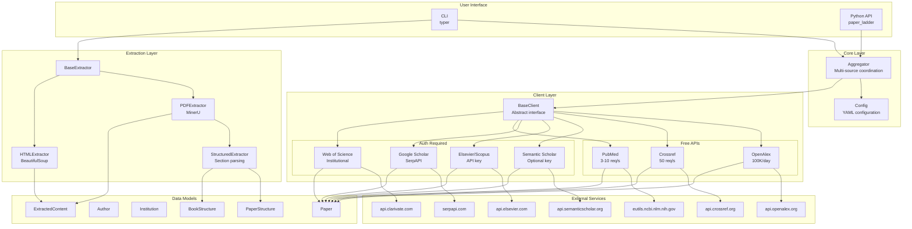

## Project Structure

```
paper-ladder/
├── src/paper_ladder/
│   ├── __init__.py           # Package exports
│   ├── models.py             # Pydantic data models
│   ├── config.py             # Configuration loader
│   ├── aggregator.py         # Multi-source aggregation
│   ├── utils.py              # Utility functions
│   ├── cli.py                # Typer CLI application
│   ├── clients/
│   │   ├── __init__.py       # Client registry
│   │   ├── base.py           # Abstract base client
│   │   ├── openalex.py       # OpenAlex API client
│   │   ├── semantic_scholar.py
│   │   ├── crossref.py       # Crossref API client
│   │   ├── elsevier.py       # Scopus/ScienceDirect client
│   │   ├── google_scholar.py # SerpAPI client
│   │   ├── pubmed.py         # PubMed E-utilities client
│   │   └── wos.py            # Web of Science client
│   └── extractors/
│       ├── __init__.py
│       ├── base.py           # Base extractor
│       ├── pdf_extractor.py  # MinerU PDF extraction
│       ├── html_extractor.py # HTML extraction
│       └── structured_extractor.py  # Structured content parsing
├── tests/
├── docs/
├── config.example.yaml
├── pyproject.toml
├── CLAUDE.md                 # Development guide
└── README.md                 # User documentation
```

---

## Data Flow Diagrams

### Search Flow

```mermaid
flowchart TB
    subgraph Input
        Q[User Query<br/>"machine learning"]
    end

    subgraph "Aggregator Layer"
        AGG[Aggregator.search]
        SRC[Source Selection<br/>openalex, crossref, semantic_scholar, pubmed, wos]
    end

    subgraph "Parallel Execution"
        direction LR
        T1[Task 1<br/>OpenAlex]
        T2[Task 2<br/>Crossref]
        T3[Task 3<br/>Semantic Scholar]
        T4[Task 4<br/>PubMed]
        T5[Task 5<br/>Web of Science]
    end

    subgraph "Rate Limiting"
        RL1[RateLimiter<br/>10 req/s]
        RL2[RateLimiter<br/>50 req/s]
        RL3[RateLimiter<br/>10 req/s]
        RL4[RateLimiter<br/>10 req/s]
        RL5[RateLimiter<br/>2 req/s]
    end

    subgraph "External APIs"
        API1[api.openalex.org]
        API2[api.crossref.org]
        API3[api.semanticscholar.org]
        API4[eutils.ncbi.nlm.nih.gov]
        API5[api.clarivate.com]
    end

    subgraph "Response Processing"
        P1[Parse JSON<br/>→ Paper objects]
        P2[Parse JSON<br/>→ Paper objects]
        P3[Parse JSON<br/>→ Paper objects]
        P4[Parse XML<br/>→ Paper objects]
        P5[Parse JSON<br/>→ Paper objects]
    end

    subgraph "Result Aggregation"
        MERGE[Round-Robin<br/>Interleaving]
        DEDUP[Deduplication<br/>by DOI & Title]
    end

    subgraph Output
        SR[SearchResult<br/>papers, total, sources, errors]
    end

    Q --> AGG
    AGG --> SRC
    SRC --> T1 & T2 & T3 & T4 & T5

    T1 --> RL1 --> API1 --> P1
    T2 --> RL2 --> API2 --> P2
    T3 --> RL3 --> API3 --> P3
    T4 --> RL4 --> API4 --> P4
    T5 --> RL5 --> API5 --> P5

    P1 & P2 & P3 & P4 & P5 --> MERGE
    MERGE --> DEDUP
    DEDUP --> SR
```

### Paper Retrieval Flow

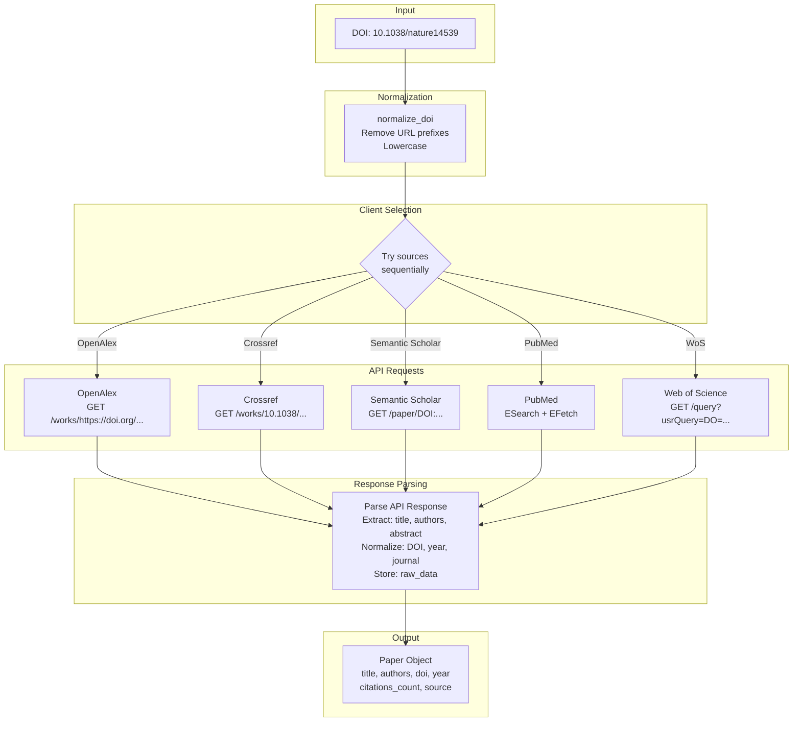

### Paper Data Merge Flow

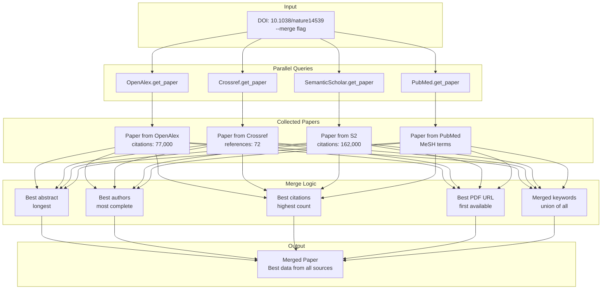

---

## Extraction Pipeline

### PDF Extraction Flow

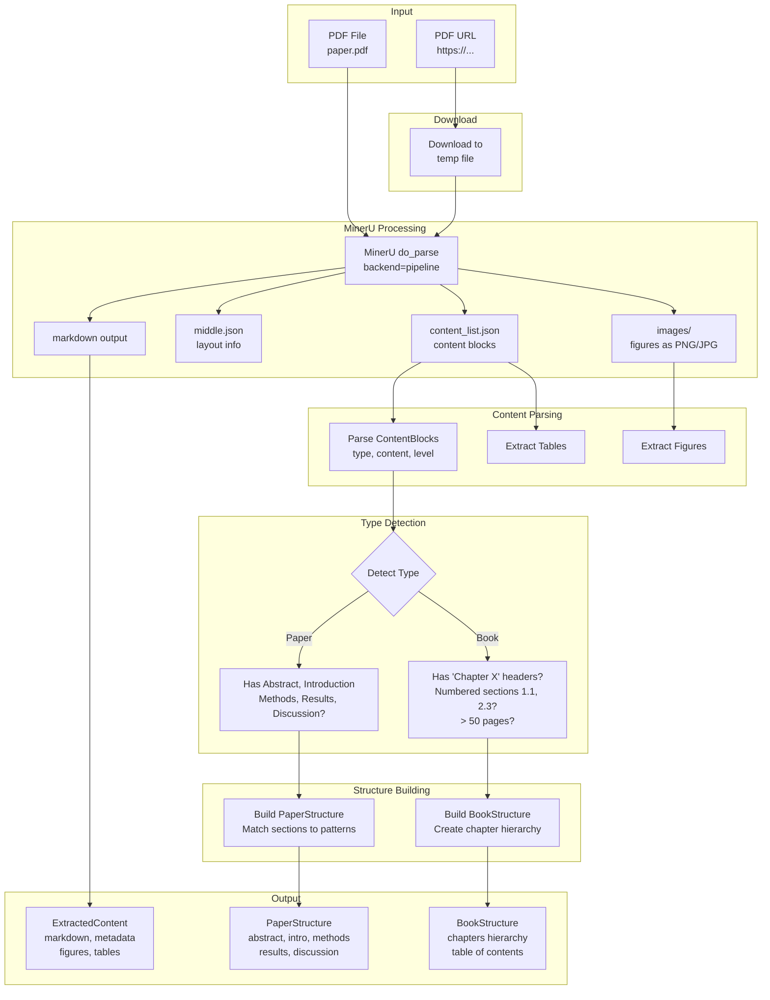

### Paper Section Matching

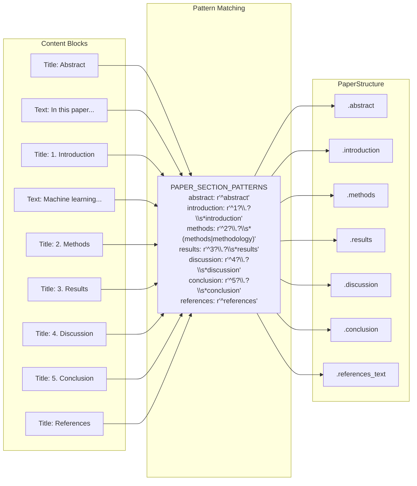

---

## Sequence Diagrams

### Multi-Source Search Sequence

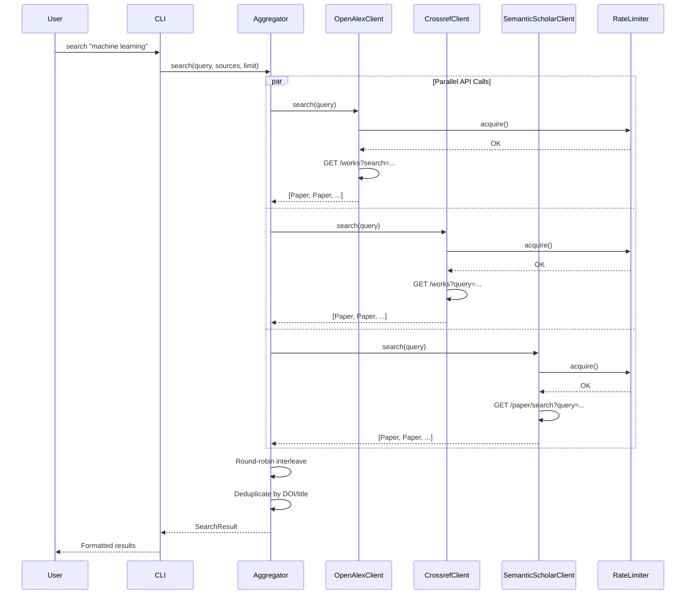

### PDF Extraction Sequence


### Rate Limiting Sequence

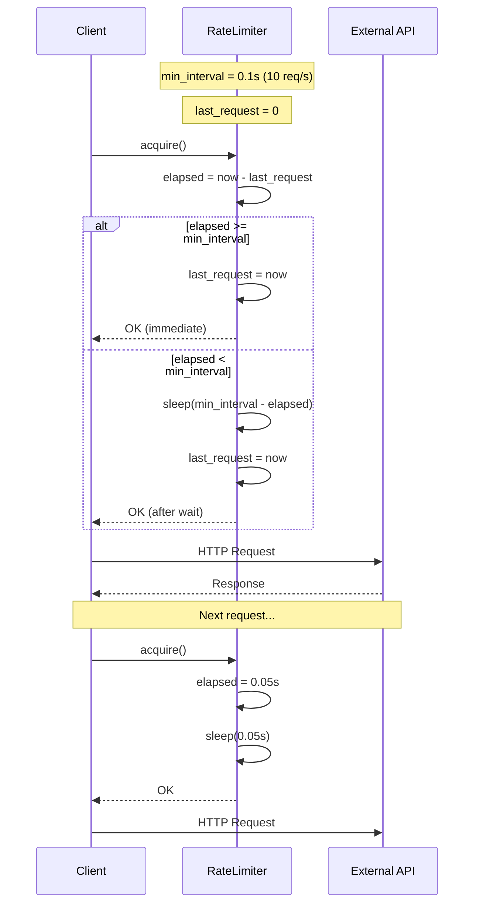

---

## Data Models

### Core Models Relationship

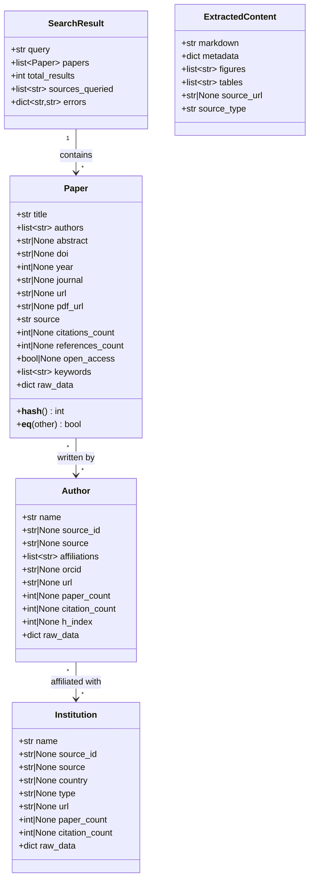

### Structured Content Models

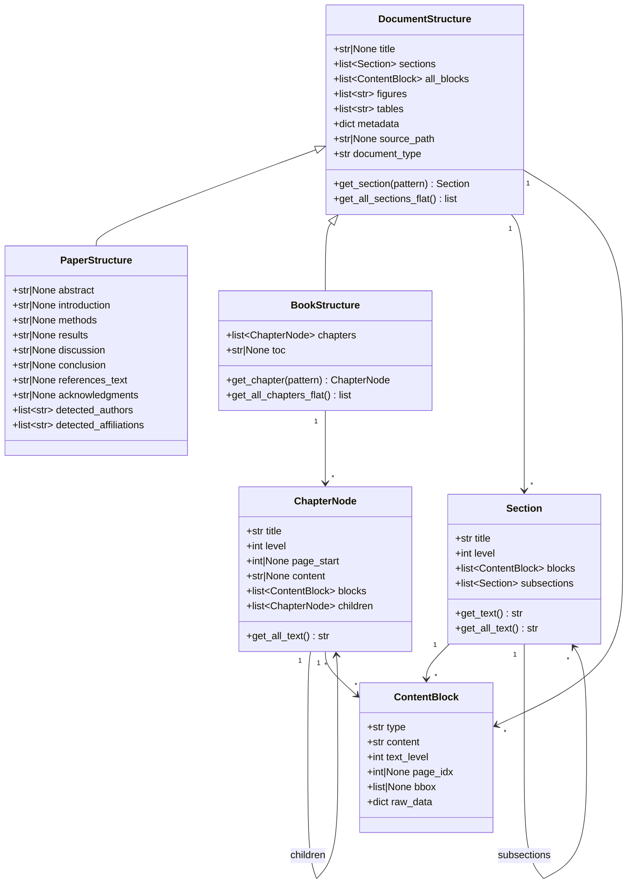

---

## API Client Capabilities

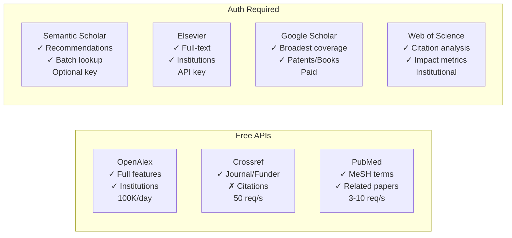

### Feature Matrix

| Feature | OpenAlex | Semantic Scholar | Crossref | Elsevier | Google Scholar | PubMed | Web of Science |
|---------|:--------:|:----------------:|:--------:|:--------:|:--------------:|:------:|:--------------:|
| search() | ✓ | ✓ | ✓ | ✓ | ✓ | ✓ | ✓ |
| get_paper() | ✓ | ✓ | ✓ | ✓ | ✓ | ✓ | ✓ |
| get_citations() | ✓ | ✓ | ✗ | ✓ | ✓ | ✓ | ✓ |
| get_references() | ✓ | ✓ | ✓ | ✗ | ✗ | ✓ | ✓ |
| search_authors() | ✓ | ✓ | ✗ | ✓ | ✓ | ✓ | ✓ |
| get_author() | ✓ | ✓ | ✗ | ✓ | ✓ | ✗ | ✗ |
| author_papers() | ✓ | ✓ | ✗ | ✓ | ✓ | ✓ | ✓ |
| institutions() | ✓ | ✗ | ✗ | ✓ | ✗ | ✗ | ✗ |
| get_journal() | ✗ | ✗ | ✓ | ✗ | ✗ | ✗ | ✗ |
| get_funder() | ✗ | ✗ | ✓ | ✗ | ✗ | ✗ | ✗ |
| recommendations() | ✗ | ✓ | ✗ | ✗ | ✗ | ✓ | ✓ |
| batch_lookup() | ✗ | ✓ | ✗ | ✗ | ✗ | ✗ | ✗ |
| **Requires API Key** | ✗ | Optional | ✗ | ✓ | ✓ | Optional | ✓ |
| **Free** | ✓ | ✓ | ✓ | ✗ | ✗ | ✓ | ✗ |
| **Max per request** | 200 | 100 | 1000 | 25 | 20 | 10000 | 100 |
| **Rate limit** | ~10/s | ~0.33/s* | ~50/s | ~2/s | ~1/s | 3-10/s | 2/s |

*Semantic Scholar: 1/s with API key

---

## Rate Limiting Architecture

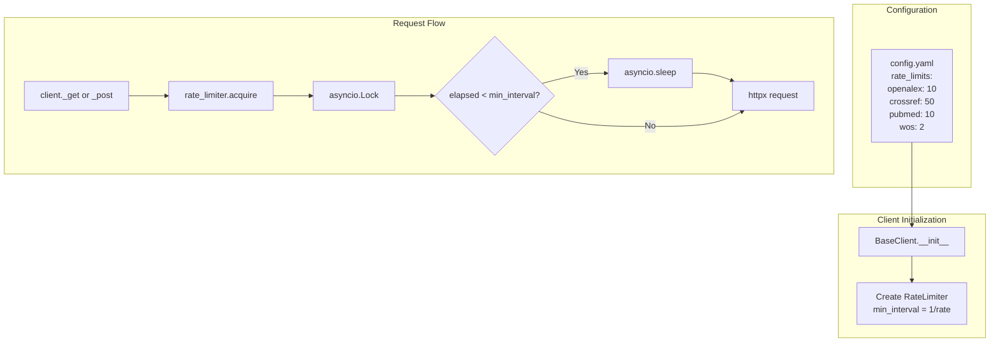

---

## Error Handling Flow

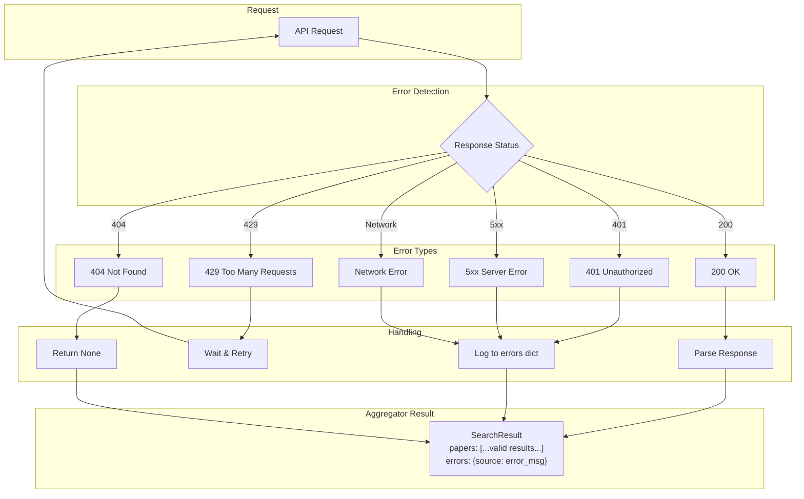

---

## Configuration

```yaml
# config.yaml

# API Keys
elsevier_api_key: "xxx"           # Required for Elsevier
serpapi_api_key: "xxx"            # Required for Google Scholar
semantic_scholar_api_key: "xxx"   # Optional, higher rate limits
pubmed_api_key: "xxx"             # Optional, 10 req/s vs 3 req/s
wos_api_key: "xxx"                # Required for Web of Science

# Default sources for aggregated search
default_sources:
  - openalex
  - crossref
  - semantic_scholar

# Rate limits (requests per second)
rate_limits:
  openalex: 10
  semantic_scholar: 10
  crossref: 50
  elsevier: 5
  google_scholar: 1
  pubmed: 10
  wos: 2

# Request settings
request_timeout: 30
max_retries: 3

# Output directory for extractions
output_dir: "./output"

# Proxy settings (optional)
proxy:
  http: "http://proxy:8080"
  https: "http://proxy:8080"
```

---

## Extending the Library

### Adding a New Client

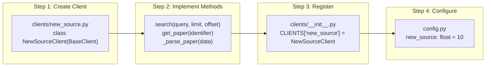

Example implementation:

```python
# src/paper_ladder/clients/new_source.py
from paper_ladder.clients.base import BaseClient
from paper_ladder.models import Paper

class NewSourceClient(BaseClient):
    name = "new_source"
    base_url = "https://api.newsource.com"

    async def search(self, query, limit=10, offset=0, **kwargs):
        params = {"q": query, "limit": limit, "offset": offset}
        response = await self._get("/search", params=params)
        return [self._parse_paper(item) for item in response.json()["results"]]

    async def get_paper(self, identifier):
        try:
            response = await self._get(f"/papers/{identifier}")
            return self._parse_paper(response.json())
        except Exception:
            return None

    def _parse_paper(self, data):
        return Paper(
            title=data["title"],
            authors=data.get("authors", []),
            doi=data.get("doi"),
            year=data.get("year"),
            source=self.name,
            raw_data=data,
        )
```

---

## Platform Strengths

| Platform | Best For |
|----------|----------|
| OpenAlex | Free, comprehensive, institution/author data |
| Semantic Scholar | AI/CS papers, recommendations, arXiv support |
| Crossref | DOI authority, journal/funder metadata, 150M+ records |
| Elsevier | Commercial database, full-text access |
| Google Scholar | Broadest coverage (books, patents, conferences) |
| PubMed | Biomedical/life sciences, MeSH indexing, free |
| Web of Science | Citation analysis, impact metrics, multi-disciplinary |
